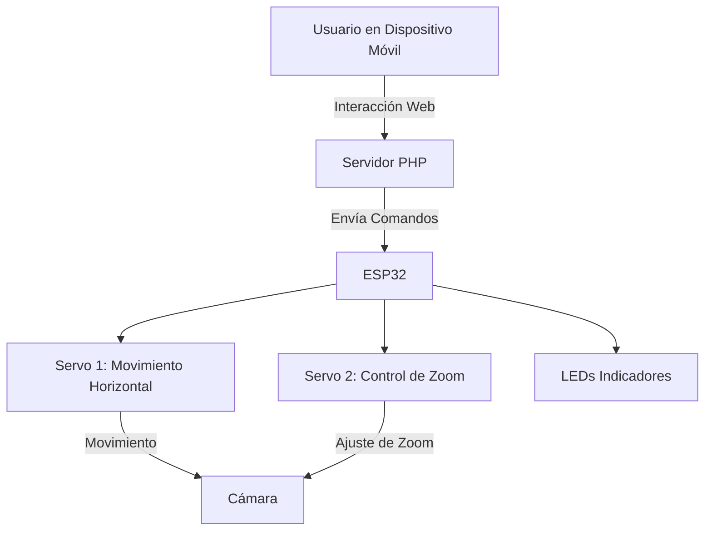
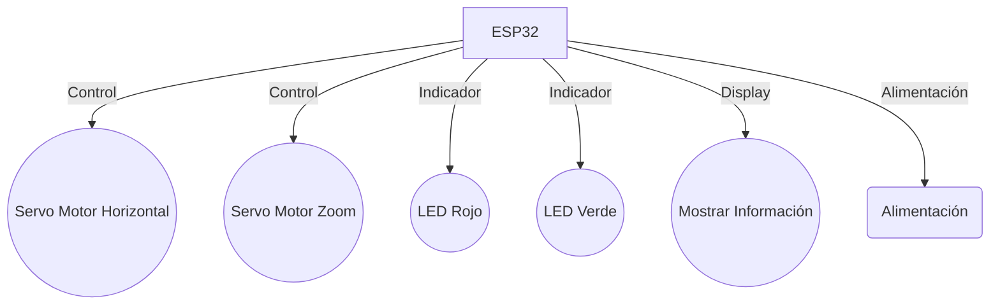

# 📷 Controlador de Cámara con ESP32 y Servo Motor 🚀

Este proyecto permite controlar una cámara de filmación montada en un trípode convencional, el cual se modifica lo mínimo posible para adaptarle dos servomotores: uno para realizar el zoom y otro para el movimiento horizontal. Para su funcionalidad, se utiliza un microcontrolador ESP32 o una placa Arduino con un módulo WiFi (ya se han realizado pruebas con un módulo Bluetooth, que resultó ineficiente en distancias largas). Las tarjetas deben tener la capacidad de gestionarse remotamente a través de una interfaz web y una aplicación disponible en Play Store. El servidor se ejecuta en PHP, ofreciendo una solución intuitiva y accesible desde dispositivos móviles para el control remoto en tiempo real.

## 🌟 Características Principales

- 🎯 Control de Movimiento Horizontal: El servomotor 1 permite mover la cámara horizontalmente para seguir a un objeto o sujeto.
- 🔍 Control de Zoom: El servomotor 2 ajusta el zoom de la cámara según sea necesario.
- 🌐 Interfaz Web Interactiva: Control de los servomotores y de los LEDs indicadores desde un sitio web simple y responsivo.
- 💡 Indicadores LED: Muestran el estado del sistema de manera visual.
- 📺 Display: Encargado de informar sobre lo que ocurre en el módulo.
- 📱 Aplicación: App que permite integrar el cambio de escena y los controles de la cámara

## 🛠️ Soluciones Utilizadas

- ESP32: Microcontrolador con conectividad Wi-Fi/Bluetooth, perfecto para IoT.
- PHP: Servidor backend que facilita la comunicación entre la web y el ESP32.
- Arduino: Usado para la programación del ESP32.
- HTML/CSS/JavaScript: Interfaz web moderna para el control de los servos y LEDs.

## ⚙️ Esquema del Proyecto

Aquí te dejo un esquema visual del flujo del proyecto utilizando Mermaid:

## 🔧 Diagrama de Conexiones (Hardware)

## 🚀 Cómo Empezar

### 1. Configura tu Hardware

Conecta los servomotores al ESP32 siguiendo el diagrama de conexiones.
Conecta los LEDs a los pines GPIO del ESP32.

### 2. Programa el ESP32

Utiliza el entorno de Arduino para cargar el código en el ESP32.
Asegúrate de instalar las bibliotecas necesarias para manejar los servomotores.

### 3. Configura el Servidor PHP

Clona el repositorio en tu servidor web.
Asegúrate de tener PHP habilitado para ejecutar el backend.

### 4. Interactúa con la Interfaz Web

Accede desde tu navegador a la IP del ESP32 o servidor PHP.
Controla el movimiento de la cámara y los indicadores LED en tiempo real.

## 💡 Posibles Mejoras Futuras

Integracion de una camara para seguimiento de objetivos.
Integración de sensores en la persona para seguimiento no visual.
Integracion con sensores en el suelo del lugar de transision.
Integración de una cámara IP para transmitir vídeo en tiempo real.
Implementación de control a través de comandos de voz.
Añadir más opciones de automatización utilizando IA.

## 🤝 Contribuciones

¡Las contribuciones son bienvenidas! Siéntete libre de enviar PRs o abrir issues para sugerencias y mejoras.

## 📜 Licencia

Este proyecto está bajo la Licencia MIT.
