# 📷 Controlador de Cámara con ESP32 y Servo Motor 🚀

Este proyecto permite controlar una cámara montada en servomotores utilizando el microcontrolador ESP32 y una placa Arduino, con la capacidad de gestionarla remotamente a través de una interfaz web. El servidor corre en PHP, ofreciendo una solución intuitiva y accesible desde dispositivos móviles para control remoto en tiempo real.

## 🌟 Características Principales

- 🎯 Control de Movimiento Horizontal: El servo motor 1 permite mover la cámara horizontalmente para seguir un objeto o sujeto.
- 🔍 Control de Zoom: El servo motor 2 ajusta el zoom de la cámara según sea necesario.
- 🌐 Interfaz Web Interactiva: Control de los servomotores y LEDs indicadores desde un sitio web simple y responsivo.
- 💡 Indicadores LED: Permiten conocer el estado del sistema de manera visual.

## 🛠️ Tecnologías Utilizadas

- ESP32: Microcontrolador con conectividad Wi-Fi/Bluetooth, perfecto para IoT.
- PHP: Servidor backend que facilita la comunicación entre la web y el ESP32.
- Arduino: Usado para la programación del ESP32.
- HTML/CSS/JavaScript: Interfaz web moderna para el control de los servos y LEDs.

## ⚙️ Esquema del Proyecto

Aquí te dejo un esquema visual del flujo del proyecto utilizando Mermaid:

```mermaid
graph TD
A[Usuario en Dispositivo Móvil] -->|Interacción Web| B[Servidor PHP]
B -->|Envía Comandos| C[ESP32]
C --> D[Servo 1: Movimiento Horizontal]
C --> E[Servo 2: Control de Zoom]
C --> F[LEDs Indicadores]
D -->|Movimiento| G[Cámara]
E -->|Ajuste de Zoom| G
```

## 🔧 Diagrama de Conexiones (Hardware)

```mermaid
graph TD
ESP32 -->|Control| Servo1((Servo Motor Horizontal))
ESP32 -->|Control| Servo2((Servo Motor Zoom))
ESP32 -->|Indicador| LED1((LED Rojo))
ESP32 -->|Indicador| LED2((LED Verde))
ESP32 -->|Alimentación| FuenteDePoder(Alimentación)
```

## 🚀 Cómo Empezar

### 1. Configura tu Hardware

Conecta los servomotores al ESP32 siguiendo el diagrama de conexiones.
Conecta los LEDs a los pines GPIO del ESP32.

### 2. Programa el ESP32

Utiliza el entorno de Arduino para cargar el código en el ESP32.
Asegúrate de instalar las bibliotecas necesarias para manejar los servomotores.

### 3. Configura el Servidor PHP

Clona el repositorio en tu servidor web.
Asegúrate de tener PHP habilitado para ejecutar el backend.

### 4. Interactúa con la Interfaz Web

Accede desde tu navegador a la IP del ESP32 o servidor PHP.
Controla el movimiento de la cámara y los indicadores LED en tiempo real.

## 💡 Posibles Mejoras Futuras

Integración de una cámara IP para transmitir vídeo en tiempo real.
Implementación de control a través de comandos de voz.
Añadir más opciones de automatización utilizando IA.

## 🤝 Contribuciones

¡Las contribuciones son bienvenidas! Siéntete libre de enviar PRs o abrir issues para sugerencias y mejoras.

## 📜 Licencia

Este proyecto está bajo la Licencia MIT.